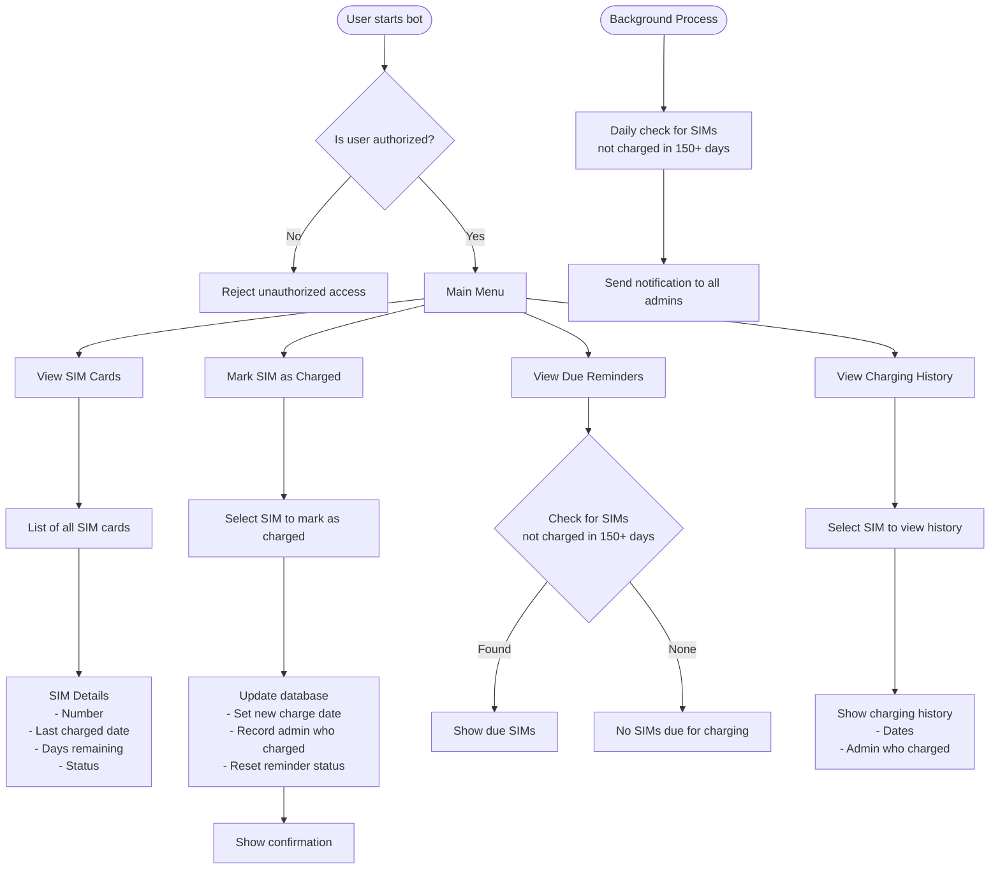

```mermaid
flowchart TD
    Start([User starts bot]) --> Auth{Is user authorized?}
    Auth -->|No| Reject[Reject unauthorized access]
    Auth -->|Yes| MainMenu[Main Menu]
    
    MainMenu --> ViewSims[View SIM Cards]
    MainMenu --> MarkCharged[Mark SIM as Charged]
    MainMenu --> ViewReminders[View Due Reminders]
    MainMenu --> ViewHistory[View Charging History]
    
    ViewSims --> SimList[List of all SIM cards]
    SimList --> SimDetails[SIM Details\n- Number\n- Last charged date\n- Days remaining\n- Status]
    
    MarkCharged --> SelectSim[Select SIM to mark as charged]
    SelectSim --> UpdateDB[Update database\n- Set new charge date\n- Record admin who charged\n- Reset reminder status]
    UpdateDB --> Confirmation[Show confirmation]
    
    ViewReminders --> CheckDB{Check for SIMs\nnot charged in 150+ days}
    CheckDB -->|Found| ShowDue[Show due SIMs]
    CheckDB -->|None| NoDue[No SIMs due for charging]
    
    ViewHistory --> SelectSimHistory[Select SIM to view history]
    SelectSimHistory --> ShowHistory[Show charging history\n- Dates\n- Admin who charged]
    
    %% Background processes
    BG([Background Process]) --> DailyCheck[Daily check for SIMs\nnot charged in 150+ days]
    DailyCheck --> NotifyAdmins[Send notification to all admins]
```